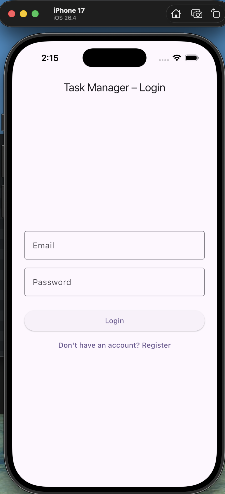
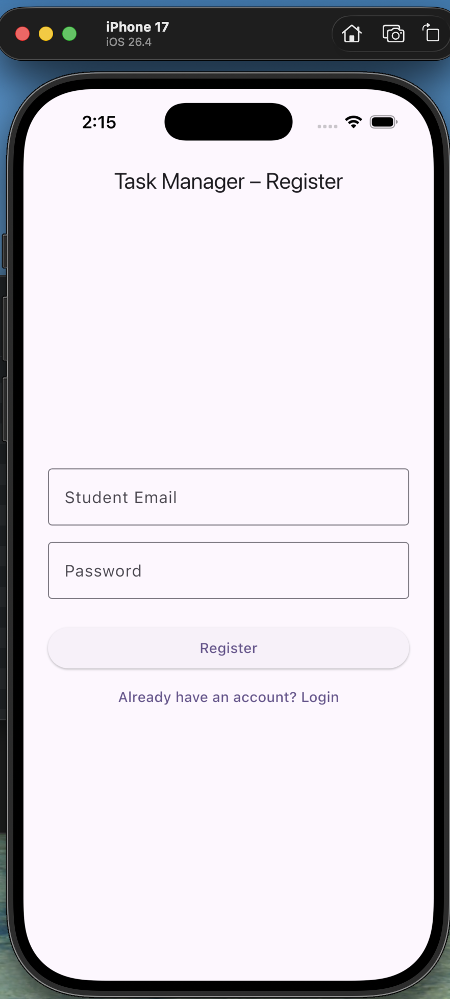
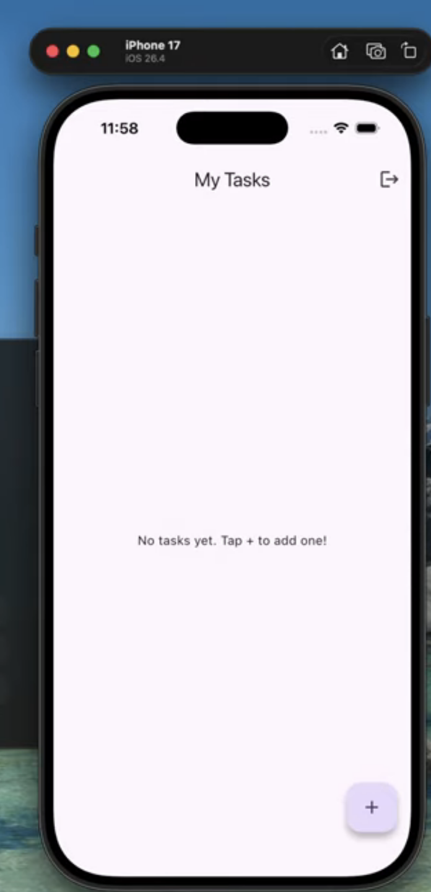
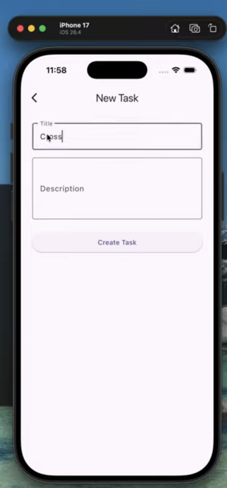
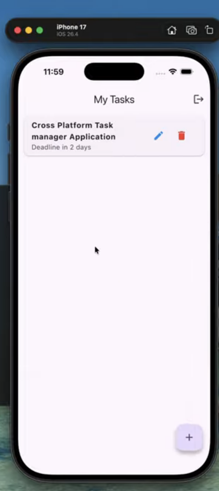
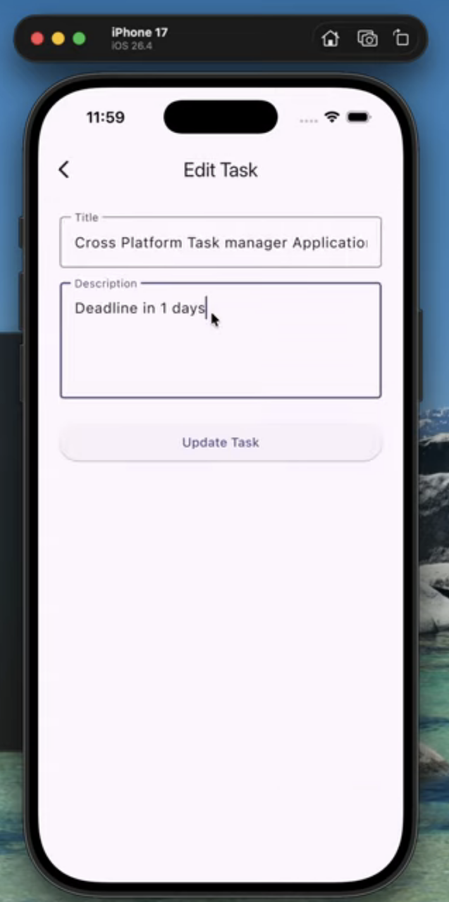

# Task Manager App

A cross-platform Task Manager application built with Flutter.

## Features

- **User Authentication**: Login and registration functionality
- **Task Management**: Create, read, update, and delete tasks
- **Task Organization**: Organize tasks with different screens

## Project Structure

```
lib/
├── main.dart              # App entry point
├── models/
│   └── task_model.dart    # Task data model
├── screens/
│   ├── home_screen.dart   # Main home screen
│   ├── login_screen.dart  # User login
│   ├── register_screen.dart # User registration
│   └── task_form_screen.dart # Create/Edit tasks
└── services/
    ├── auth_service.dart  # Authentication service
    └── task_service.dart  # Task CRUD operations
```

## Getting Started

### Prerequisites

- Flutter SDK (>=3.0.0)
- Dart SDK
- Android Studio / VS Code

### Installation

1. Clone the repository
2. Run `flutter pub get` to install dependencies
3. Run `flutter run` to start the app

## Platforms Supported

- Android
- iOS
- Web
- macOS
- Linux
- Windows

## Screenshots

### Authentication Screens




### Task Management Screens




